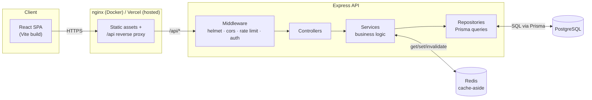
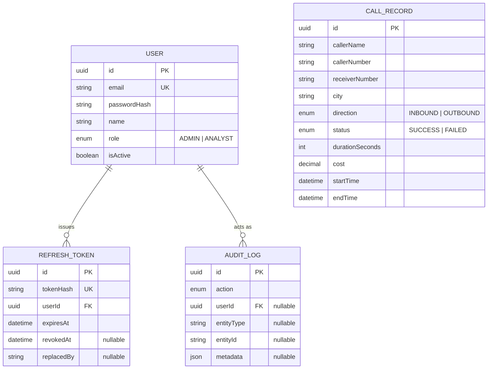

# CallVitals Pro

A production-grade telecom intelligence platform: a secure, authenticated backend API in front of 10,000 real Call Data Records, and the CallVitals dashboard (from Week 2) rewired to run entirely on it.

This is the Week 3 evolution of [CallVitals](https://github.com/Nifemie27/callvitals), which fetched a mock API directly from the browser with no auth and no write path. CallVitals Pro adds the backend architecture, access control, and API-driven communication that a real internal telecom tool would need.

**Live:** [callvitals-pro.vercel.app](https://callvitals-pro.vercel.app) &middot; API: [callvitals-pro-backend.onrender.com](https://callvitals-pro-backend.onrender.com/health)

Demo accounts are listed below. The backend is on Render's free tier, so the first request after a period of inactivity takes ~30 seconds to wake up.

## Contents

- [Architecture](#architecture)
- [Features](#features)
- [Technology stack](#technology-stack)
- [Repository layout](#repository-layout)
- [Getting started](#getting-started)
- [Environment variables](#environment-variables)
- [Demo accounts](#demo-accounts)
- [Database schema](#database-schema)
- [API](#api)
- [Authentication and RBAC](#authentication-and-rbac)
- [Caching](#caching)
- [Audit logging](#audit-logging)
- [Testing](#testing)
- [Deployment](#deployment)
- [Security notes](#security-notes)
- [Assignment requirement checklist](#assignment-requirement-checklist)

## Architecture



The backend follows Clean Architecture: controllers only coordinate a request, all business rules live in services, and all database access is isolated behind repositories. Nothing above the repository layer knows Prisma exists.

## Features

**Backend**
- RESTful API for call records: paginated list, filter, search, sort, CRUD, CSV/PDF export
- Analytics endpoints computed server-side: summary, top callers, direction/status distribution, calls per day, calls per city (with an honest long-tail "Other" bucket), period-over-period trends
- JWT authentication: short-lived access tokens, rotating httpOnly refresh tokens with reuse detection, secure logout
- Role-based access control: `ADMIN` (full CRUD + user management) and `ANALYST` (read-only)
- Redis caching with automatic invalidation on writes, and graceful degradation if Redis is unavailable
- Audit log of every login, role change, and data mutation, queryable by admins
- Structured JSON logging, a global error handler, and input validation on every write endpoint

**Frontend**
- Every view fetches from the backend; no mock data anywhere
- Login/register, protected routes, automatic silent session restore and access-token refresh
- Role-aware UI: analysts see read-only data, admins additionally see create/edit/delete controls and a Users page
- Server-driven pagination, filtering, sorting, and search on the call log
- Authenticated CSV/PDF export downloads
- The full Week 2 design system carried over: loading skeletons, error states with retry, empty states, light/dark/system theme

## Technology stack

| Layer | Choice |
|---|---|
| Backend | Node.js, Express 5, TypeScript |
| ORM / database | Prisma, PostgreSQL |
| Cache | Redis (ioredis) |
| Auth | JWT (jsonwebtoken), bcrypt |
| Validation | express-validator |
| Backend tooling | Jest + Supertest, ESLint (typed), Prettier |
| Frontend | React 19, TypeScript, Vite, Tailwind CSS v4, shadcn/ui (Radix) |
| Frontend data | TanStack Query, Axios, React Hook Form, Zod |
| Charts | Recharts |
| Containers | Docker, Docker Compose |

## Repository layout

```
CallVitalsPro/
├── backend/
│   ├── src/
│   │   ├── api/            # controllers, routes, middleware, validators
│   │   ├── services/       # business logic
│   │   ├── repositories/   # Prisma queries, nothing else touches Prisma
│   │   ├── dto/            # request/response shapes
│   │   ├── errors/         # AppError hierarchy
│   │   ├── database/       # Prisma client + Redis client singletons
│   │   ├── config/         # env loading and validation
│   │   └── utils/          # jwt, password hashing, csv, query parsing, ...
│   ├── prisma/              # schema, migrations, seed script + seed data
│   ├── tests/                # unit + integration (Jest + Supertest)
│   └── Dockerfile
├── frontend/
│   ├── src/
│   │   ├── features/        # auth, calls, analytics, users (hooks + schemas)
│   │   ├── services/api/    # typed API client functions
│   │   ├── pages/            # route-level components
│   │   └── components/      # layout, charts, table, cards, ui primitives
│   └── Dockerfile
├── docs/
│   └── API.md               # full endpoint reference
├── docker-compose.yml
└── render.yaml               # Render blueprint for the backend
```

## Getting started

### Option A: Docker Compose (fastest)

```bash
cp .env.example .env
# generate secrets:
node -e "console.log(require('crypto').randomBytes(48).toString('hex'))"
# paste the output into JWT_ACCESS_SECRET and JWT_REFRESH_SECRET in .env

docker compose up -d
```

This provisions Postgres and Redis, runs migrations, seeds the database (10,000 call records + two demo accounts), and starts the backend and frontend. Once every service reports healthy:

- Frontend: http://localhost:8080
- Backend API: http://localhost:4000/api
- Health check: http://localhost:4000/health

### Option B: Run backend and frontend locally

```bash
# Postgres + Redis only
docker compose up -d postgres redis

cd backend
cp .env.example .env   # DATABASE_URL already points at the compose Postgres on :5433
npm install
npm run prisma:migrate
npm run prisma:seed
npm run dev             # http://localhost:4000

# in a second terminal
cd frontend
cp .env.example .env
npm install
npm run dev              # http://localhost:5173
```

## Environment variables

See `backend/.env.example` and `frontend/.env.example` for the full list with defaults. The essentials:

| Variable | Where | Description |
|---|---|---|
| `DATABASE_URL` | backend | PostgreSQL connection string |
| `JWT_ACCESS_SECRET` / `JWT_REFRESH_SECRET` | backend | Long random strings, must differ from each other |
| `REDIS_URL` | backend | Redis connection string; caching disables itself gracefully if unreachable |
| `REDIS_TLS` | backend | Set to `true` for managed Redis providers (e.g. Upstash) that require TLS even on a `redis://` connection string; leave `false` for local/Docker Redis |
| `CORS_ORIGIN` | backend | The frontend's origin, required for credentialed cross-origin requests |
| `COOKIE_SECURE` | backend | `true` in any deployment served over HTTPS (also switches the refresh cookie to `SameSite=None` for cross-domain setups) |
| `VITE_API_BASE_URL` | frontend | The backend's `/api` base URL |

## Demo accounts

Seeded automatically:

| Role | Email | Password |
|---|---|---|
| Admin | `admin@callvitals.dev` | `Admin123!Change` |
| Analyst | `analyst@callvitals.dev` | `Analyst123!Change` |

Override with `SEED_ADMIN_PASSWORD` / `SEED_ANALYST_PASSWORD` before seeding. Change these before any real deployment.

## Database schema



`CallRecord` has no foreign key to `User`; it's the CDR dataset itself, not user-owned data. `AuditLog.userId` is nullable and `onDelete: SetNull`, so the audit trail survives even if the acting user is later deleted.

## API

Full reference: [docs/API.md](docs/API.md).

Quick shape: every response is `{ success, data, message, pagination, timestamp }`. Every route except auth's public endpoints requires `Authorization: Bearer <token>`.

## Authentication and RBAC

- **Access tokens**: stateless JWT, 15 minute default lifetime, verified on every request without a database hit (the user's active/role status is cached for 30 seconds so a deactivation or role change takes effect quickly without a query on every single request).
- **Refresh tokens**: opaque random strings, not JWTs (no benefit to being self-describing when they're revocable by database row anyway). Stored as a SHA-256 hash, delivered via an httpOnly cookie scoped to `/api/auth`. Rotated on every use; presenting an already-rotated token is treated as theft and revokes every session for that user.
- **Roles**: `ADMIN` (CRUD on call records, user management, full analytics) and `ANALYST` (read-only analytics and call records). Enforced by backend middleware on every route, not just hidden in the UI.

## Caching

Analytics and call-list reads use a cache-aside pattern (`cacheService.wrap`): check Redis, compute and populate on a miss, invalidate the `calls` and `analytics` prefixes on any write. If Redis is down, every cache operation fails soft (a miss, or a no-op write) rather than taking the API down.

## Audit logging

Every login, failed login, logout, role change, deactivation, deletion, call record mutation, and export is recorded with actor, IP, user agent, and a timestamp. Queryable by admins at `GET /api/audit-logs`.

## Testing

```bash
cd backend
npm test              # unit + integration, against a real Postgres instance
npm run test:coverage
```

78 tests: unit tests for pure logic (password hashing, JWT, query parsing, pagination math, CSV escaping, the error handler's status-code mapping, and the auth service's business rules with repositories mocked), integration tests for every route (auth lifecycle, RBAC enforcement, CRUD, filtering, CSV export, analytics correctness) run with Supertest against the real Express app and a dedicated `callvitals_test` database.

## Deployment

Full step-by-step instructions: [docs/DEPLOYMENT.md](docs/DEPLOYMENT.md).

### Docker Compose (self-contained)

```bash
docker compose up -d
```

Brings up Postgres, Redis, runs migrations and seeding, then starts the backend and the frontend (served by nginx, which reverse-proxies `/api` to the backend so the SPA never needs CORS in this deployment mode).

### Free-tier hosted deployment

- **Frontend**: [Vercel](https://vercel.com): static Vite build, `vercel.json` already configured for SPA routing.
- **Backend**: [Render](https://render.com): deploys directly from `backend/Dockerfile` (see `render.yaml`). Migrations and seeding run automatically on boot (idempotent, safe to repeat).
- **Database**: [Neon](https://neon.tech): serverless Postgres, free tier, no card required.
- **Redis**: [Upstash](https://upstash.com): serverless Redis, free tier, no card required.

When frontend and backend are on different domains, set `COOKIE_SECURE=true` on the backend (switches the refresh cookie to `SameSite=None`) and set `CORS_ORIGIN` to the frontend's exact deployed origin.

## Security notes

- Helmet, CORS restricted to a configured origin, rate limiting (tighter on auth routes), request body size limits, bcrypt (cost 12), parameterized SQL everywhere (including the raw analytics queries, via Prisma's tagged-template `Prisma.sql`), and sanitized error messages in production.
- `npm audit` on the backend is clean for runtime dependencies; remaining findings are transitive dev-tooling (Jest/Prisma CLI internals) that never ship in the production image.
- Two accepted, reviewed findings on the frontend: `react-router` flags a CSRF-bypass advisory that applies to its RSC/framework mode, which this project doesn't use (`createBrowserRouter`, no server actions); `shadcn` is a dev-only CLI never bundled into the shipped app.

## Assignment requirement checklist

| Requirement | Status | Where |
|---|---|---|
| CDR data access: paginated, filterable (date, caller/receiver, city) | Done | `GET /api/calls` |
| Analytics: total calls, total duration, distribution, top callers | Done | `/api/analytics/*` |
| REST conventions, proper HTTP methods/status codes | Done | see [docs/API.md](docs/API.md) |
| Structured error responses | Done | global error handler, consistent envelope |
| Pagination, query optimization, no N+1 | Done | indexed queries, cursor-based export iteration |
| User registration (optional) + login | Done | `/api/auth/register`, `/api/auth/login` |
| JWT auth, secured routes, token validation | Done | access + refresh tokens, `authenticate` middleware |
| RBAC: Admin (full) vs Analyst (view-only) | Done | `authorize()` middleware on every mutating route |
| Password hashing | Done | bcrypt, cost 12 |
| Secure token storage | Done | httpOnly refresh cookie, in-memory access token |
| Input validation and sanitization | Done | express-validator on every write endpoint |
| Frontend: real API integration, no mock data | Done | full rewrite of the data layer |
| Frontend: auth flow, protected routes | Done | `AuthProvider`, `ProtectedRoute`, `RequireRole` |
| Frontend: dynamic filtering wired to backend | Done | `useCallFilters` → query params |
| Frontend: loading/error/empty states | Done | carried over and extended from the Week 2 design system |
| Bonus: Redis caching | Done | cache-aside with invalidation |
| Bonus: audit logging | Done | `AuditLog` table + admin endpoint |
| Bonus: Docker support | Done | multi-stage Dockerfiles + docker-compose.yml |
| Bonus: CSV export | Done | streamed, filter-aware |
| Bonus: PDF export | Done | streamed report with summary + up to 2,000 rows |
